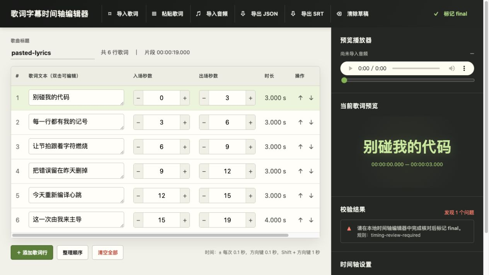
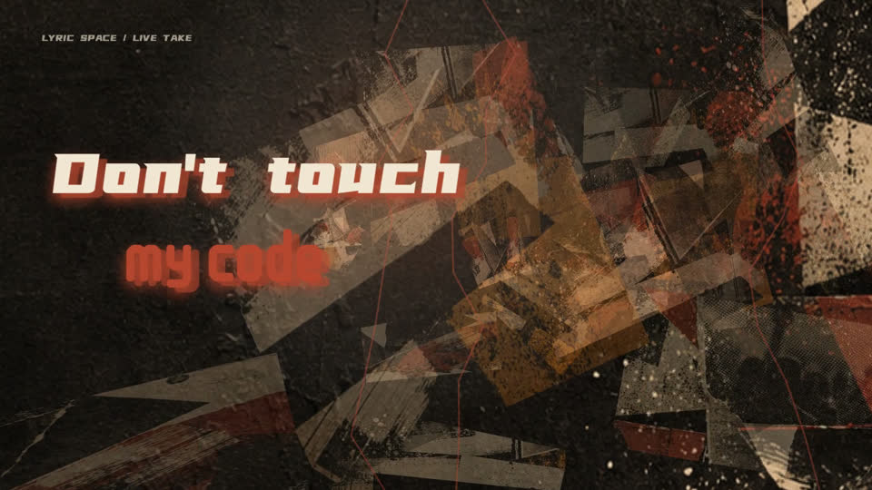

# Cimu（词幕）

把本地音频和歌词制作成可审阅、可复跑的歌词 MV。

Cimu 是一个 Agent Skill。你只需提供素材并描述成片要求，Agent 会完成歌词时间轴、视觉方案、渲染和验收，无需手动编辑 JSON 或执行渲染命令。

## 主要能力

- 支持 MP3、M4A、AAC 音频。
- 支持 LRC、SRT、ASS 和纯文本歌词。
- 支持完整歌曲、指定时间段、主歌、副歌或某句歌词。
- 支持 16:9 横版和 9:16 竖版。
- 可用自然语言指定风格、颜色、动画强度、重点句和禁止效果。
- 本地 WebGL + Canvas 渲染，不依赖在线生成服务。
- 输出 H.264/AAC MP4，并保留时间轴、视觉方案和验收记录。

默认先交付 1280×720、24fps 的横版预览；确认歌词、构图和风格后，再按需导出 1920×1080、30fps 横版母版。

## 安装

```bash
npx skills add https://github.com/ShamProfessor/cimu --skill cimu -g
```

本机需要：

- Node.js 20+
- FFmpeg 和 FFprobe
- Google Chrome 或 Chromium

安装后，在 Agent 对话中直接调用 `cimu`。运行环境会在渲染前自动检查。

## 快速开始

上传音频和歌词，或提供它们的本地绝对路径：

```text
用 cimu 制作歌词 MV。
音频：/Users/me/music/song/source/song.mp3
歌词：/Users/me/music/song/source/song.lrc
输出到：/Users/me/music/song/delivery
```

也可以直接上传音频并粘贴歌词。若目录中有多个版本，请明确指定使用哪一个文件。

## 常用用法

### 完整歌曲

```text
用 cimu 制作完整歌曲的 16:9 歌词 MV，使用默认视觉方案。
```

### 指定时间片段

```text
制作一条 20 秒、16:9 的歌词 MV，从 00:18.930 开始。
```

```text
只做第一段副歌，从“我不会回头”开始，到下一段主歌前结束。
```

时间范围会同时用于歌词和音频裁切。段落边界不明确时，Agent 会先确认识别出的歌词与时间。

### 竖版版本

```text
先做完整歌曲的横版母版，再适配一条 15 秒、9:16 的副歌版。
```

横版和竖版会分别检查断行、构图与安全区。

### 指定整体风格

```text
城市夜景、独立电影片头感，整体克制，字体偏文学。
副歌比主歌更强，但不要霓虹、RGB 分离和闪白。
```

```text
使用纸张和旧印刷质感，暖色，镜头缓慢。
“成都，带不走的只有你”作为重点句，其余句子保持安静。
```

可指定：

- 视觉气质、场景、字体倾向和调色板；
- 整体或分段动画强度；
- 主歌、副歌、结尾的不同表现；
- 某一句的入场、保持和出场方式；
- 重点句、强调词、分组和禁止效果。

明确提出的要求优先于自动方案，最终选择会写入 `style-plan.json`，便于复跑。

### 使用自己的背景

可以提供封面、照片或视频，并说明使用范围、裁切方式和字幕安全区。

未提供背景时，Cimu 会从内置场景中选择合适方向，包括编辑拼贴、传统印刷、街头复印、摇滚舞台、独立夜景、流行柔光、民谣纸张和城市路线。

Cimu 默认不会搜索网络素材，也不会在线生成 AI 背景。

### 只有纯文本歌词

```text
音频已上传，下面是纯文本歌词。请先帮我逐句校时，确认后再生成完整横版 MV。
```

纯文本会先生成时间草稿，并在本地时间轴编辑器中逐句审核。未经审核的自动时间不能作为正式交付。

### 本地歌词时间轴编辑器

当歌词没有可靠时间码，或现有 LRC/SRT/ASS 需要修正时，可以直接告诉 Agent：

```text
用 cimu 打开本地歌词时间轴编辑器。
导入这首歌和歌词，让我逐句校对时间；确认后继续生成 MV。
```

Agent 会在本机启动编辑器并打开浏览器。编辑器只运行在 `127.0.0.1`，不需要登录，也不会上传音频和歌词。

1. 导入 LRC、SRT、ASS，或按行粘贴纯文本歌词。
2. 选择本地音频，播放时会自动高亮当前歌词。
3. 调整每一句的文本、入场和出场时间；也可以增删、排序、拆分或合并歌词行。
4. 处理重叠、越界、空文本和停留时间等校验提示。
5. 点击“标记 final”并导出审核稿，Agent 随后会继续验证和渲染。



## 输入与默认规则

| 项目   | 支持或默认值                                       |
| ------ | -------------------------------------------------- |
| 音频   | MP3、M4A、AAC                                      |
| 歌词   | LRC、SRT、ASS、UTF-8 纯文本                        |
| 范围   | 默认完整歌曲，也可指定起止时间、时长、段落或歌词句 |
| 画幅   | 默认 16:9；可指定 9:16                             |
| 分辨率 | 默认 1280×720 预览；正式版为 1920×1080             |
| 帧率   | 默认 24fps 预览；正式版为 30fps                    |
| 成片   | H.264 视频 + AAC 音频                              |
| 背景   | 默认使用内置程序化场景                             |

推荐使用带可靠时间码的 LRC、SRT 或 ASS。源音频和歌词不会被覆盖。

## 制作流程

1. 检查素材、范围、画幅和运行环境。
2. 整理并验证歌词时间轴。
3. 分析歌曲与歌词段落，生成视觉方案。
4. 校验场景、动画和用户限制。
5. 本地逐帧渲染并封装 MP4。
6. 检查尺寸、时长、编码、音频、黑边和关键画面。

自动检查通过后，仍会人工查看开场、密集歌词、重点句、转场和结尾。

## 交付内容

交付目录只放用户需要的视频：

```text
preview-16x9.mp4          默认横版预览
# 或：master-16x9.mp4     明确要求正式版时生成
```

渲染参数、时间轴、样式计划和验收报告会放在同目录下的隐藏 `.cimu/` 文件夹，仅用于复跑或排障；普通用户无需打开或理解它们。

建议按歌曲和片段保存：

```text
song-project/
  source/                 原始音频和歌词
  work/                   已审核时间轴与人工调整
  delivery/song-range/    用户可直接使用的 MP4
    .cimu/                隐藏的复跑与排障记录
```

保留交付目录即可；需要修改歌词、时间、风格或画幅时，Agent 会在隐藏工作记录的基础上重新生成。

## 参考样片

`Don't Touch My Code` 的 20 秒横版示例（18.93s–38.93s，1280×720、30fps）：
点击下方预览图播放：

[](https://www.youtube.com/watch?v=DbYPYUO8kFM)

## 维护与开发

普通发布检查：

```bash
node skills/cimu/scripts/release-check.mjs
```

命令、参数、时间轴编辑器和排障说明见 [开发文档](docs/DEVELOPMENT.md)。

## 许可证

[MIT License](LICENSE)
