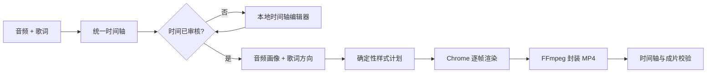

# Cimu（词幕）

把本地音频和歌词做成可审阅、可复跑的歌词 MV。Cimu 是一个 Agent Skill：你提供素材和想要的成片，Agent 负责时间轴、视觉方案、渲染与验收，不要求你操作 JSON 或渲染命令。

## 它做什么

- 接收 MP3/M4A/AAC 音频和 LRC、SRT、ASS 或纯文本歌词。
- 将已带时间码的歌词转为统一时间轴；纯文本必须先在本地编辑器逐句审核。
- 根据歌词与音频生成确定性的视觉方案，并保存在 `style-plan.json`，方便修改后复跑。
- 导出横版或竖版 MP4，以及时间轴、音频画像、视觉方案和成片校验报告。

默认交付是完整歌曲的 1920×1080、30 fps 横版母版。需要片段或 9:16 时，在请求里直接说明。

## 安装

```bash
npx skills add https://github.com/ShamProfessor/cimu --skill cimu -g
```

安装完成后，重新开启或继续一个 Agent 对话即可使用 `cimu`。

## 怎么用

把音频和歌词附到对话里，然后直接描述结果：

```text
用 cimu 把这个 MP3 和 LRC 做成 20 秒、16:9 的歌词 MV；从第一句主歌开始，视觉用代码与工业拼贴感。
```

```text
用 cimu 做一条 9:16 的歌词视频；我只有音频和纯文本歌词，先让我审核每一句的时间。
```

```text
用 cimu 检查这份 LRC 的错词、重叠和错拍；修好后渲染完整横版 MV。
```

Agent 只会追问必要信息：音频、歌词、片段范围和画幅。带时间码的歌词会进入校验；纯文本会停在时间轴编辑器，直到逐句审核完成，才会渲染交付。

## 输入与交付

| 项目 | 内容 |
| --- | --- |
| 音频 | MP3、M4A、AAC |
| 歌词 | LRC、SRT、ASS；或 UTF-8 纯文本 |
| 成片 | `master-16x9.mp4`（请求竖版时为对应竖版成片） |
| 可复跑侧车 | `timeline`、`audio.json`、`song-profile.json`、`direction.json`、`style-plan.json`、`job.json` |
| 验收 | `timeline-validation.json` 与 `delivery-validation.json` |

## 技术方案



关键不是“自动套一个字幕模板”：歌词先被规范化为可校验的时间轴；视觉选择由歌曲画像和固定 seed 生成，并写入侧车文件；最终通过 FFprobe、黑边检查和关键段人工观看共同验收。修改歌词、时间或视觉方向后，可以从侧车文件定位并重新渲染。

本机渲染需要 Node.js 20+、FFmpeg/FFprobe 与 Google Chrome 或 Chromium。首次执行时，Agent 会检查这些组件并明确报告缺少项。

## 20 秒可下载示例

仓库包含 `Don't Touch My Code` 的 20 秒横版示例（18.93s–38.93s，1280×720、30 fps）：


- [下载示例 MP4](examples/dont-touch-my-code/20s-sample/delivery/master-16x9.mp4)
- [查看时间轴](examples/dont-touch-my-code/20s-sample/timeline.json)
- [查看视觉方案](examples/dont-touch-my-code/20s-sample/delivery/style-plan.json)
- [查看成片校验报告](examples/dont-touch-my-code/20s-sample/delivery/delivery-validation.json)

## 验收与维护

每次交付都会校验时间轴、编码、尺寸、时长与黑边，并应人工观看开场、密集歌词、hook、转场和结尾。仓库随附的 20 秒示例及全部侧车文件可用于发布检查；维护说明见 [docs/DEVELOPMENT.md](docs/DEVELOPMENT.md)。

## 许可证

源代码与文档采用 [MIT License](LICENSE)。
