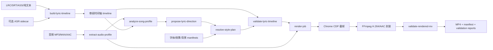

# Cimu（词幕）技术架构

## 1. 定位与设计目标

Cimu（词幕）是一个**本地优先、可审阅、可复现**的歌词视觉 MV 制作引擎。它将音频与歌词时间轴转化为可验证的 H.264/AAC 成片；核心交付物不是某次偶然渲染出的 MP4，而是一套可重跑的项目证据链。

设计约束：

- 以 16:9、1920×1080、30fps 为主母版；9:16 是独立的适配交付。
- 不依赖云端生成视频、Whisper、React、Remotion、Three.js 或托管服务。
- 原始歌词不可被流程覆写；时间事实、创意决策和渲染结果必须分层保存。
- 自动创意必须由 seed 固化，显式人工覆盖必须优先于自动选择。
- 未审阅的纯文本或 ASR 对齐只能生成草稿，不能绕过交付校验。

## 2. 运行时边界

| 层级 | 当前实现 | 责任 | 是否为交付路径必需 |
| --- | --- | --- | --- |
| 编排层 | Node.js ES modules | CLI、文件组织、子进程编排、报告落盘 | 是 |
| 音频分析 | FFmpeg / FFprobe | 时长、RMS、频带、节拍候选、音频截取 | 是 |
| 时间轴编辑 | 本地 HTTP 服务 + 浏览器编辑器 | 导入歌词、逐句校时、校验提示、导出审阅稿 | 仅无可靠时间码时需要 |
| 视觉决策 | 本地 Node 脚本 + JSON manifests | 歌曲画像、段落语义、字体/效果/背景方案 | 是 |
| 图形渲染 | 原生 WebGL + Canvas | 背景深度、光效、动效字体与安全阅读区 | 是 |
| 帧捕获 | Headless Chrome + CDP | 逐帧调用 `renderAt(t)`，截取 PNG | 是 |
| 封装与验收 | FFmpeg + Node 校验器 | H.264/AAC 封装、采样边缘检查、清单生成 | 是 |
| 在线 ASR | Tencent Flash adapter | 仅产生对齐草稿；凭据由调用方提供 | 否 |

系统不会隐式调用在线服务。ASR 适配器已实现但默认未启用；AI 生成背景、AE/Lottie 与 Remotion 均是可替换的未来/外部能力，而非本发布版依赖。

## 3. 总体数据流



关键边界如下：

1. **时间层**只回答“哪句歌词在何时出现”；它不保存临时效果选择。
2. **分析层**从歌词与音频提取可解释的路由证据，不直接控制每一帧。
3. **方向层**提出可编辑的句子角色和重要度，保留人工审阅标记。
4. **样式层**将创意选择固化为可重放的 `style-plan.json`。
5. **渲染层**只消费已固定的输入；不在浏览器内重新随机选择效果。
6. **验收层**独立判断时间轴与成片是否合格，不以“能渲染”代替“可交付”。

## 4. 规范化时间轴与状态机

所有歌词格式先归一化为 schemaVersion 2 的 JSON。最小结构为：

```json
{
  "schemaVersion": 2,
  "sourceStartSeconds": 18.93,
  "durationSeconds": 8,
  "lyricSource": {"kind": "lrc", "timingStatus": "timed-lrc"},
  "review": {"required": false},
  "lines": [
    {"start": 0, "end": 1.2, "text": "Don't touch my code"}
  ]
}
```

`lines[]` 是唯一的歌词时间事实。`groups` / `groupStarts` 用于一句中的视觉分组，但不改变原文阅读顺序。来源状态决定交付资格：

| 输入 | `timingStatus` | 默认状态 | 允许直接交付 |
| --- | --- | --- | --- |
| LRC | `timed-lrc` | 已有行级时间 | 可以，仍须通过校验 |
| SRT / ASS | 对应的原生时间码状态 | 已有区间 | 可以，仍须通过校验 |
| 纯文本 + 已批准 sidecar | `alignment-backed` | 需确认匹配准确性 | 审阅后可以 |
| 纯文本 | `draft-no-alignment` | 草稿 | 不可以 |
| 在线 ASR sidecar | 草稿对齐状态 | 草稿 | 不可以，必须人工核对 |

`validate-lyric-timeline.mjs` 会阻止空文本、负值、越界、行重叠、分组顺序错误、最终组停留时间不足、未审阅草稿与低置信度对齐。这个阻断发生在像素渲染之前。

## 5. 创意决策链

### 5.1 音频画像

`extract-audio-profile.mjs` 使用 FFmpeg 在目标范围内计算帧级 RMS、低/中/高频能量及节拍候选。数据只驱动有上限的视觉响应，例如光晕尺度、卡片速度、闪白强度和纹理漂移；不会直接产生不可复现的编舞。

### 5.2 歌曲画像与视觉路由

`analyze-song-profile.mjs` 依据歌词词汇、能量、演唱密度和情绪弧线，输出 `visualProfile`、背景策略、母题包和反模式。当前包含：`code-collision`、`macau-heritage`、`night-market-copy`、`concrete-anthem`、`folk-letterpress`、`folk-city-walk`、`pop-memory-release` 等路由。画像是建议，不会覆盖艺术家指定的 profile 或时间轴覆盖项。

### 5.3 语义方向

`propose-lyric-direction.mjs` 为行补充 `role` 与 `importance`：重复句可成为 hook，强语气/关键词可成为 punchline，每次最多建议三句 `importance: 5` 的 hero 文本。使用 `--regroup` 时，仅将由导入器生成的单行组安全拆为 1–3 个视觉短语；已有人工分组或明确效果不会被替换。

### 5.4 确定性样式方案

`resolve-style-plan.mjs` 汇总时间轴、歌曲画像和三份 manifest：

- `manifests/fonts.json`：本地字体、文件路径、许可记录和路由偏好；
- `manifests/effects.json`：build / breathe / resolve / transition / overlay 效果约束；
- `manifests/backgrounds.json`：背景、母题和 profile 映射。

解析器以稳定 seed 生成 `style-plan.json`，并执行相邻行不重复 build、30 秒最多三条 hero、hero 转场仅用于高重要度文本、最小可读停留等规则。优先级从高到低为：**时间轴显式覆盖 > 手工 override > 样式解析器 > profile 默认值**。

## 6. 图形与合成架构

自动路径由 `assets/webgl-hiphop-hook.html` 的共享运行时承载，并按 profile 使用不同的 `SCENES` 参数：调色板、卡片密度、纵深、运动速度和镜头幅度不同。原生 WebGL 以 Chrome SwiftShader 软件后端保证环境一致性，Canvas 模板仍可作为明确指定的人工回退方案。

固定层级必须保持不变：

```text
超扫 WebGL 背景世界
        ↓
透明 Canvas 光效层
        ↓
独立 Canvas 歌词前景层
```

- **背景世界**：带深度缓冲的纹理平面、透视相机、持续移动的卡片场；Hook 仅增强同一场景的推力、密度与近景遮挡，不切换到无关场景。
- **光效层**：叠加 grain、flashbulb、电场或 ember 等效果，永远不接管文字可读区。
- **歌词层**：按 `build → readable hold/breathe → resolve` 生命周期绘制。歌词占据一条连续阅读通道，分组是视觉节奏而非逐字卡拉 OK。

背景平面会超出相机视锥，clear color 跟随 profile。这样在透视移动、分辨率变更或裁切时不会露出黑边。16:9 会利用横向空间放置视觉层与留白；9:16 需要独立检查安全区、断行和遮挡。

## 7. 渲染、封装与可复现性

`run-delivery.mjs` 是唯一正式交付入口。它先运行运行时检查，将 CLI 参数写为 `job.json`，再委派 `render-job.mjs`。后者依序生成：音频画像、歌曲画像、方向、样式方案、时间轴校验、PNG 帧、MP4、成片校验和 manifest。

`render-browser-sample.mjs` 对每一个帧时间调用浏览器的 `window.renderAt(t)`，通过 CDP 截图写入临时 PNG 序列；随后 FFmpeg 使用 H.264、`yuv420p`、CRF 18 与 AAC 192 kb/s 封装原音频目标片段，并设置 fast-start 元数据。Chrome 有独立进程组，端口、启动、截帧和编码阶段均有超时与清理逻辑。

同一组以下输入应得到可重现的视觉选择：已审阅时间轴、音频范围、视觉 profile、字体/效果 manifest 版本、显式 override 与 seed。要复跑历史订单，应保留这些 sidecar，而不仅保留 MP4。

## 8. 交付物与验收

正式输出目录至少应包含：

```text
master-16x9.mp4
delivery-validation.json
delivery-manifest.json
timeline-validation.json
audio.json
song-profile.json
direction.json
style-plan.json
job.json
```

`validate-rendered-mv.mjs` 会核对 H.264/AAC 编码、时长、尺寸及采样帧边缘，阻止黑边/黑缝等明显合成问题。输出 manifest 将这些中间决策与最终成片关联，形成可审计的交付包。

发布验收分两层：

1. `release-check.mjs`：检查 Node 20+、FFmpeg、FFprobe、Chrome/Chromium 与核心自检，适用于独立安装包。
2. `release-check.mjs --with-goldens`：验证随源仓库发布的 20 秒 16:9 H.264/AAC 参考成片及其时间轴、画像、视觉计划和校验侧车。

自动校验不能替代人工观看。完整审阅必须抽查开场、文本最密集处、hook/hero、转场和结尾，并确认文字未被高亮背景、模糊、光效或次级元素遮挡。

## 9. 扩展点与变更影响

| 需求 | 修改层 | 必要证明 |
| --- | --- | --- |
| 新音乐类型或视觉 profile | 歌曲路由、样式规则、背景 manifest、模板映射 | 20–30 秒横版 golden 样片 |
| 新字体 | 本地字体包、字体 manifest、路由规则 | 许可记录与可读性帧检查 |
| 新动效 | Canvas 效果模块、effects manifest | 固定 seed 短样片与安全阅读区检查 |
| 新分组逻辑 | direction / override / timeline validator | 时间轴校验通过 |
| 更强节拍响应 | 音频画像或模板适配层 | 前后对照帧与人工观看 |
| 艺术家品牌资产 | timeline/style-plan override 与素材许可记录 | 资产许可和安全区审阅 |
| 云端规模化 | 独立 job/state/queue 适配层 | worker 可重跑与状态可追踪 |

不得通过直接修改 MP4 或在浏览器中临时硬编码来实现上述需求；这样会切断 JSON 证据链并破坏回归能力。

## 10. 运行安全与故障隔离

- 所有输入均使用绝对路径；原始音频和歌词文件只读使用。
- 本地编辑器只绑定 `127.0.0.1`，不暴露局域网端口。
- 外部 ASR 凭据不写入时间轴、style plan 或 delivery manifest。
- 临时帧放入系统临时目录，由渲染器清理；正式输出仅写入用户指定的 `--out`。
- Chrome 缺失时，通过 `LYRIC_MV_CHROME_PATH` 显式指定，不应偷换成不兼容浏览器。
- 失败时优先保留已有 JSON 侧车文件和校验报告，从失败阶段重新执行；不要用手动替换 MP4 掩盖失败。

## 11. 当前成熟度

当前版本已覆盖“音频 + 已审阅行级歌词 → 确定性视觉模板 → 可验证 MP4”的本地生产路径。它尚不是托管式自助产品：多人审阅、资产管理、分布式队列、授权素材市场和在线 ASR 运营仍是上层产品能力。任何未来迁移都应保留本时间轴合同、确定性样式方案与独立验证器，避免把可复现的本地引擎退化为不可审计的黑盒渲染服务。
